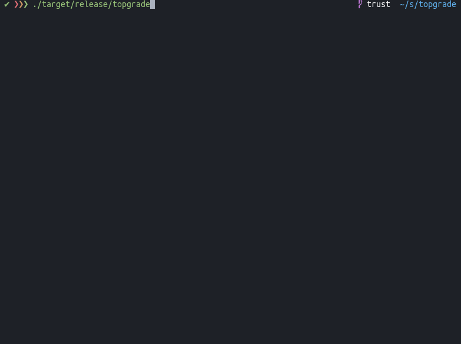

# Topgrade [](https://travis-ci.org/r-darwish/topgrade)



Keeping your system up to date mostly involves invoking more than a single package manager. This
usually results in big shell one-liners saved in your shell history. Topgrade tries to solve this
problem by detecting which tools you use and run their appropriate package managers.

## Installation
Arch Linux users can use the [AUR](https://aur.archlinux.org/packages/topgrade/) package.

Other systems users can either use `cargo install` or use the compiled binaries from the release page.

## Usage
Just run `topgrade`. It will run the following steps:

* Run the system package manager:
  * *Arch*: Run [yay](https://github.com/Jguer/yay) or fall back to pacman
  * *CentOS/RHEL*: Run `yum upgrade`
  * *Fedora* - Run `dnf upgrade`
  * *Debian/Ubuntu*: Run `apt update && apt dist-upgrade`
  * *macOS*: Run `brew update && brew upgrade`
* Check if the following paths are tracked by Git. If so, pull them:
  * ~/.emacs.d (Should work whether you use [Spacemacs](http://spacemacs.org/) or a custom configuration)
  * ~/.zshrc
  * [~/.oh-my-zsh](https://github.com/robbyrussell/oh-my-zsh)
  * ~/.tmux
  * ~/.config/fish/config.fish
  * Custom defined paths
* *Unix*: Run [zplug](https://github.com/zplug/zplug) update
* *Unix*: Upgrade tmux plugins with [TPM](https://github.com/tmux-plugins/tpm)
* Run Cargo [install-update](https://github.com/nabijaczleweli/cargo-update)
* Upgrade Emacs packages
* Upgrade Vim packages. Works with the following plugin frameworks:
  * [NeoBundle](https://github.com/Shougo/neobundle.vim)
  * [Vundle](https://github.com/VundleVim/Vundle.vim)
  * [Plug](https://github.com/junegunn/vim-plug)
* Upgrade NPM globally installed packages
* Upgrade Atom packages
* *Linux*: Run [fwupdmgr](https://github.com/hughsie/fwupd) to show firmware upgrade. (View
  only. No upgrades will actually be performed)
* Run custom defined commands
* Final stage
  * *Linux*: Run [needrestart](https://github.com/liske/needrestart)
  * *macOS*: Upgrade App Store applications

## Customization
You can place a configuration file at `~/.config/topgrade.toml`. Here's an example:


``` toml
git_repos = [
    "~/dev/topgrade",
]

[commands]
"Python Environment" = "~/dev/.env/bin/pip install -i https://pypi.python.org/simple -U --upgrade-strategy eager jupyter"
```
